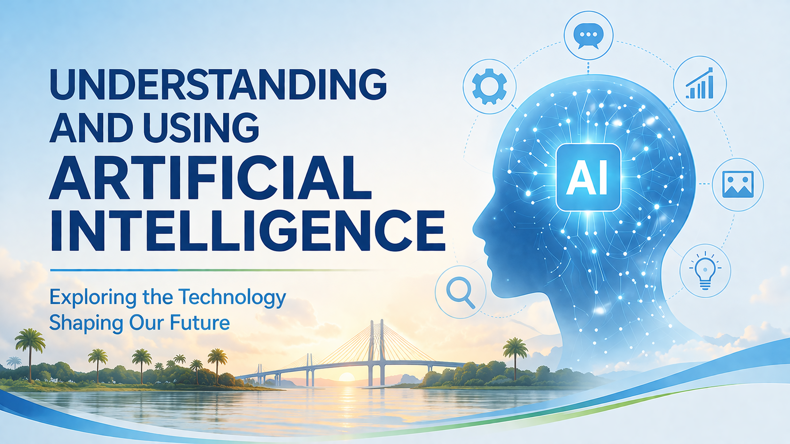
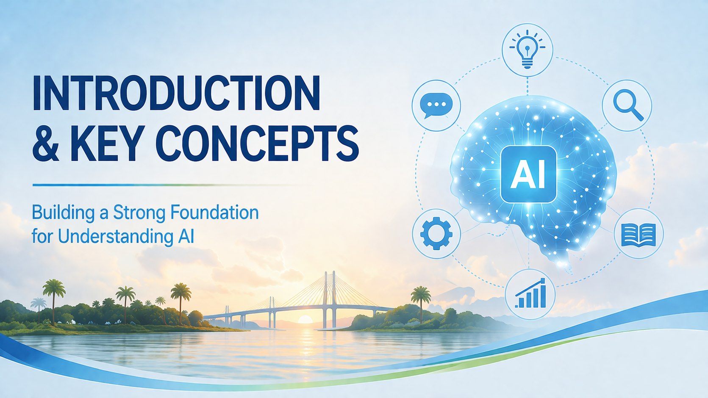
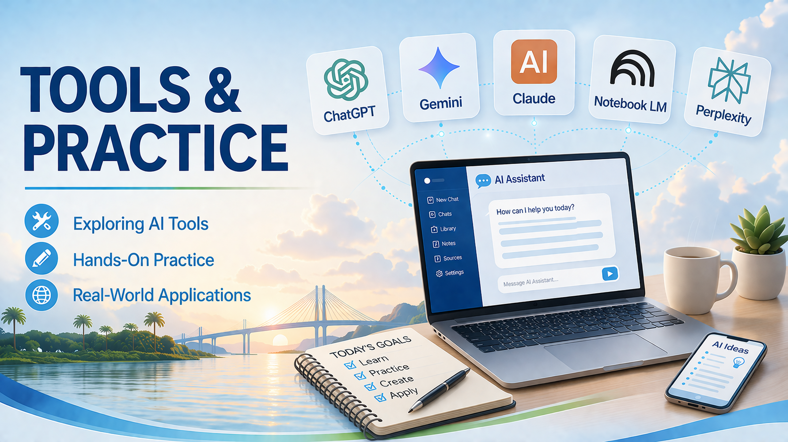
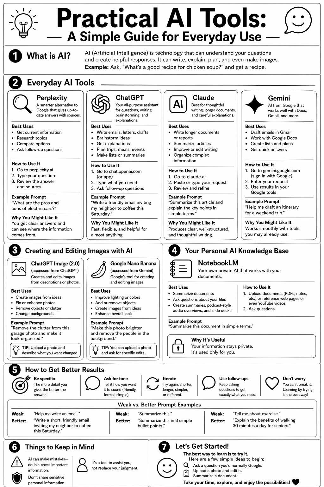

class: title

class: center, middle

.full[]

---

# AI and You

## Understanding and Using Artificial Intelligence

.right.small[

]

**SCHH Computer Club Hour**   
April 24, 2026

Ron Snyder ([ron@snyderjr.com](mailto:ron@snyderjr.com))

[https://rsnyder.github.io/presentations/ai-essentials.pdf](https://rsnyder.github.io/presentations/ai-essentials.pdf)

---

class: title

class: center, middle

.full[]

---

# AI Is Already in Your Life

You've been using AI for years — probably without realizing it

- **Email spam filter** — AI decides what's junk before you ever see it
- **Netflix & Spotify** — AI learns your taste and surfaces what you'll like
- **GPS navigation** — AI reroutes you around traffic in real time
- **Autocorrect** — AI predicts what word you meant to type
- **Credit card fraud alerts** — AI flags unusual charges instantly
- **Voice assistants** — Siri, Alexa, Google — all AI-powered

> The chatbot-style AI getting attention today is a new, more *visible* form of something that has quietly been part of daily life for years.

???
Start here. This is the most important slide in Part 1 because it reframes AI from something alien and intimidating to something familiar. The goal is to lower anxiety before you've explained anything technical.

Take a moment with each example — pause and let people nod. Most will recognize several of these. The credit card example is especially useful because it's AI actively protecting them, which is a positive frame.

Optional: quick show of hands — "How many of you have used a voice assistant?" "How many got a fraud alert on a card in the last year?" The more hands, the better.

The key message: AI is a tool, and you've already been benefiting from it. Today we're just going to talk about how to use the newer, more powerful version intentionally.

---

# What Is Artificial Intelligence?

**AI** is a broad term for computer systems that can do things that normally require human intelligence

- Understanding language
- Recognizing faces, images, and speech
- Making decisions and predictions
- Learning from experience and improving over time

> Think of it less like a robot brain and more like a **very sophisticated pattern-matching machine** trained on enormous amounts of human knowledge.

AI isn't one single thing — it's a *family of technologies*

???
Keep this high-level. The goal isn't a technical definition — it's a useful mental model.

The "pattern-matching machine" framing is important because it demystifies AI. It learned from patterns in human-produced content — it isn't thinking the way we do. This sets up hallucinations later: if it's pattern-matching rather than "knowing," that explains why it can be confidently wrong.

Avoid the word "algorithm" — it tends to make people's eyes glaze over. Stick to concrete examples of what AI does.

You can briefly acknowledge that AI has been around for decades as a research field, but the recent leap in what it can do — especially understanding and generating language — is genuinely new and significant.

---

# Generative AI

A type of AI that **creates** new content — rather than just analyzing or sorting existing content

**It can generate:**
- Text — articles, letters, summaries, code, poetry
- Images — photos, illustrations, artwork
- Audio — music, voice, sound effects
- Video — synthetic footage, animation

> When you ask an AI to write a letter, summarize an article, or create an image of a sunset — that's generative AI at work.

The "generative" part means it **produces something new each time**, not just retrieving a stored answer

???
This is where most people's eyes light up — because this is the AI they've been hearing about in the news.

The distinction from search is important here, though you'll go deeper on that later. Search retrieves. Generative AI creates.

A useful analogy: the difference between a library (retrieves existing books) and a very well-read author (creates something new, drawing on everything they've read). The author might make things up — the library doesn't. This seeds the hallucinations discussion later.

If time allows, you can show a quick example — ask an AI to write a two-sentence summary of what generative AI is. The output IS the demonstration.

---

# Large Language Models (LLMs)

The technology **behind most of today's AI chatbots**

- Trained on vast amounts of text — books, websites, articles, and more
- Learned language by identifying patterns across billions of examples
- Can understand and generate human language naturally
- "Large" refers to the scale of both training data and mathematical complexity

> Think of it like someone who has read an enormous amount becoming a strong writer and communicator — they've absorbed the patterns of language without memorizing every book word-for-word.

**ChatGPT, Claude, and Gemini are all built on LLMs**

???
This is the one slide where you go slightly under the hood. Keep it brief — one minute is enough.

The key insight: the AI didn't memorize the internet. It learned patterns from it. This is why it can write in any style, answer almost any question, and also why it can be wrong — it's working from patterns, not a lookup table of facts.

You don't need to explain transformers, tokens, or neural networks. The reading analogy is sufficient and accurate enough for this audience.

The last bullet — naming ChatGPT, Claude, Gemini — is a natural bridge to the chatbot slide that follows.

---

# What Is a Chatbot?

An AI you talk to — **in plain English**

- You type a question or request; it responds in full sentences
- No special commands, no search syntax — just conversation
- Very different from older chatbots (phone trees, website pop-ups)
- Today's chatbots understand nuance, context, and follow-up questions

> You talk to it the way you'd talk to a knowledgeable friend.

???
Start with the show of hands — most hands will go up, which validates that the audience already has firsthand experience. This is useful framing. They're not starting from zero.

Emphasize the contrast with older "chatbots." The word chatbot has bad connotations for many people because of frustrating automated phone systems and useless website pop-ups. Today's tools are fundamentally different — they generate language rather than matching keywords to scripted responses.

If you're presenting live and connected to the internet, this is a good place for your first brief demo. Open Claude or ChatGPT and type something simple — "Can you explain what a chatbot is, like I've never heard of one?" Let the response speak for itself.

---

# Context & Memory

## Within a conversation
The AI remembers **everything said so far** — you can refer back and it follows along

## Between conversations
**ChatGPT**, **Claude** and **Gemini** all remember information about you across sessions; you don't have to re-introduce yourself each time

- **Memory is not perfect or complete.**  It retains highlights and preferences, not a word-for-word transcript of every conversation
- **You are in control.**  You can view what it remembers, correct it, or delete it entirely in settings
- **Memory can be turned off.** If you prefer a fresh slate every session, that option exists
- **Incognito / temporary chats.** Both tools offer a no-memory mode for sensitive conversations you don't want retained

> Think of it like a colleague who keeps notes on your working relationship — they remember your preferences and background, but not every word of every meeting. And you can always ask to see their notes.

???
Optional memory features: ChatGPT, Claude and Gemini now offer optional memory that carries across sessions. It's worth a brief mention — "some tools let you turn this on, so it remembers your preferences over time." But keep it brief. The default is no memory, and that's the more important thing to understand.

The practical tip is the most actionable thing on this slide. Give people a concrete before/after. The difference in response quality between a vague question and a contextualized one is dramatic, and you can demonstrate it live.

---

# Thinking Mode vs. Regular Mode

## Regular mode
Fast, conversational — the AI responds immediately, drawing on its training
*Great for: everyday questions, writing help, casual conversation*

## Thinking mode
The AI works through the problem **step by step** before answering — like showing its work
*Takes a little longer, but handles complex questions more reliably*

> Like the difference between a quick reply and asking someone to sleep on it and give you their considered answer.

**Use regular for:** simple questions, writing help, casual chat

**Use thinking for:** planning, analysis, anything with multiple steps or a right answer that matters

???
Keep this to about one minute. The mental model is what matters, not the mechanics.

Some tools let you see the thinking process — a collapsible section that shows the AI's reasoning before its final answer. Others just take a moment and deliver a better result without showing the work. Both are the same underlying idea.

You can optionally demonstrate this live — ask a simple question in regular mode, then ask a more complex multi-step question and point out that the response takes a moment longer and shows more structured reasoning.

This slide can be combined with the Context & Memory slide into a single "How Chatbots Work" slide if you're pressed for time.

---

class: warning

# Hallucinations

When AI **confidently states something that is simply not true**

- AI generates language based on patterns — not by looking facts up
- It can produce false information that sounds completely authoritative
- A made-up statistic. A fake quote. A book that doesn't exist. A law that was never passed.
- It's not lying — **it doesn't know it's wrong**

> This is the most important thing to understand about AI safety.

## The rule

**Never rely on AI alone for anything important** — medical, legal, financial, or factual.
Always verify with a trusted second source.

*Think of AI as a very well-read research assistant who occasionally makes things up with total confidence.*

???
This is the most important safety slide in the presentation. Give it time.

The word "hallucination" is the technical term — it's worth using because your audience will encounter it. But explain it plainly: the AI confidently made something up.

The most useful analogy: imagine someone who has read thousands of books and has an answer for everything — but occasionally, when they don't quite know the answer, instead of saying "I don't know," they make something plausible-sounding up and deliver it with the same confidence as a real fact. You'd find them incredibly useful, but you'd also know to double-check anything important.

Practical examples that resonate: asking an AI to summarize a medical article it hasn't actually read, asking for a local attorney's contact information, asking about a specific law or regulation. These are high-risk use cases.

The takeaway isn't "don't use AI" — it's "don't use AI as your only source for anything that matters."

---

# Knowledge Cutoff

AI models are trained up to a **specific date** — after which they have no knowledge of world events

- If something happened after that date, the AI genuinely doesn't know
- It might guess, or confidently describe something that has since changed
- This is why AI might not know about recent news, new products, or changes in the law

> Always ask about time-sensitive topics with this in mind — and verify with current sources.

## Some AI tools can search the web
Perplexity and others connect AI to live search — giving you current information with sources cited

*We'll see this in the Tools & Practices section*

???
This is a short slide — one minute is enough. The concept is simple.

The knowledge cutoff is also why asking an AI "what is today's date?" will often produce an uncertain or hedged answer. It knows approximately when its training ended but can't know how much time has passed since then.

A good framing: "It's like asking someone who just came back from a year abroad. Incredibly knowledgeable — but they've missed a year of news."

The bridge to Perplexity is worth planting here so that tool makes sense in Part 2. One of Perplexity's key advantages is that it connects AI reasoning to live search results, solving the knowledge cutoff problem for current events and recent information.

---

# Prompts & Prompting

A **prompt** is simply what you type — your question or request

The way you ask shapes what you get

## Tips for better prompts

- **Be specific** — vague questions get vague answers
- **Give context** — tell it who you are and why you're asking
- **Ask for a format** — "explain it simply" / "give me a short list" / "write it as a letter"
- **Follow up** — if the answer isn't right, say so. It responds to feedback.

> Think of it as a conversation, not a search box.

**Before:** *"Tell me about Medicare."*

**After:** *"I'm 72 and recently moved to South Carolina. I have Parts A and B but I'm confused about whether I need a supplemental plan. Can you explain my options in plain language?"*

???
This is the most actionable slide in Part 1 — what they remember here will directly shape how useful AI is to them from day one.

The before/after Medicare example is your strongest teaching tool. If you have time, show both prompts live and let the audience see the difference in response quality. The contrast is usually dramatic enough to be self-explanatory.

Emphasize the follow-up point. Many first-time users give up after one disappointing response. They don't realize they can just say "that's not quite what I meant" and the AI will adjust. Iteration is the skill.

Frame positively: you don't have to be perfect at this. These tools are forgiving. But these basics make a real difference.

---

# Privacy — What Happens to What You Type?

## What you should know

- Most AI tools **store your conversations**, at least temporarily
- Free tools are more likely to use conversations to train future models
- Paid or enterprise versions typically offer stronger privacy protections
- Different companies have different policies — worth reading for tools you use regularly

## The practical rule

**Don't share sensitive personal information with any AI tool:**
- Social Security numbers
- Financial account numbers or passwords
- Detailed medical records
- Anything you wouldn't say to a helpful stranger

> Treat it like a knowledgeable professional you've just met — useful to talk to, but not someone you'd hand your private documents to.

???
Privacy is a topic your audience cares deeply about — make sure this lands without being alarmist.

The practical rule is the key takeaway. People don't need to memorize privacy policies — they need one clear, memorable heuristic: don't type things into an AI that you wouldn't say to a stranger who was being helpful.

The free vs. paid distinction is worth a sentence: free tools are great for getting started, but if someone is using AI regularly for anything sensitive, the paid version (typically $20/month for ChatGPT Plus or Claude Pro) offers better protections and more capable models.

If your audience asks about specific companies, stick to general principles rather than making specific claims — privacy policies change frequently.

---

class: warning

# Deepfakes

AI can generate **realistic fake video, audio, and images** of real people

- A public figure saying something they never said
- A phone call that sounds like a family member in distress
- A photograph of an event that never happened

## The grandparent scam — updated

AI can now **clone a voice** from just a few seconds of audio.
Scammers use this to call grandparents pretending to be a grandchild in trouble — needing bail money, emergency funds, urgent help.

> If you receive an unexpected call from a "family member" in crisis — hang up and call them directly on a number you already know.

## Watch for
Faces that look slightly off · teeth and hair edges that blur · unnatural blinking

???
This is the highest-stakes safety slide in the presentation. Give it full attention.

The grandparent scam is the most personally relevant example for your audience and has no political baggage. It's also real, documented, and growing. AARP has covered it extensively if you want to reference a familiar source.

The voice cloning point is genuinely alarming but important to name — people need to know that a phone call that sounds exactly like their grandchild may not be. The action is simple and memorable: hang up, call back on a number you already have.

Other examples you can use briefly:
- The Biden robocall in the 2024 New Hampshire primary directed Democrats not to vote
- A fake photo of an explosion near the Pentagon briefly moved financial markets in 2023
- AI-generated fake celebrity images spread widely on social media

Keep the tone measured — the goal is informed skepticism, not panic. The audience can't stop deepfakes from existing, but they can slow down before believing what they see and hear.

---

class: warning

# Image Watermarking

AI image watermarking is the practice of attaching information to an image so it can later be identified as AI-generated or traced back to its source. In 2026, the field is converging on a mix of provenance metadata such as C2PA, invisible pixel-level watermarks, and platform labeling to support transparency and compliance.

- **Adoption is increasing**, with C2PA emerging as the main open standard for image provenance and authenticity records.
- **Current systems are still fragile** because metadata is often stripped when images are uploaded, reposted, edited, or screenshotted.
- Invisible watermarks can survive some compression and resizing, but many **can still be weakened or removed by determined attackers**.
- **Watermarking does not prove truth by itself**; it helps record origin, but it cannot fully prevent spoofing, editing, or contradictory provenance signals.
- **Regulation is accelerating adoption**, with EU AI Act transparency obligations for labeling AI-generated content taking effect on August 2, 2026.

???
C2PA (Coalition for Content Provenance and Authenticity) is an open technical standard for attaching tamper‑evident “content credentials” to digital media so anyone can see where a file came from and how it was edited. It is designed to make the origin and history of images, video, audio, and documents transparent in an ecosystem where AI‑generated and heavily edited content are common.

---

class: warning

# AI Slop

The flood of **low-quality, AI-generated content** now polluting the internet

- Fake news articles written by AI with no human author
- AI-generated product reviews that all sound identical
- Spam blog posts that fill the web with plausible-sounding nonsense
- Fake photos of events, places, and people that don't exist
- Social media posts generated in bulk to manipulate opinion

> You've probably already encountered it without knowing what to call it.

## How to spot it

- **Generic, vague writing** that says a lot without saying anything specific
- **No author name** or a publication you've never heard of
- **Reviews that all sound the same** — suspiciously enthusiastic, no specifics
- **Images that look polished but feel slightly wrong** — trust that instinct

## The habit that protects you from both deepfakes and AI slop

**Slow down and verify before you believe or share.**

???
"AI Slop" is a new term but a useful one — colorful, memorable, and accurate. It gives your audience a label for something they've probably already encountered and been frustrated by.

The practical list of red flags is the most useful part of this slide. Walk through each one. The "feels slightly wrong" instinct is real and worth naming explicitly — people often notice something is off before they can articulate why, and validating that instinct is helpful.

The shared closing rule — slow down and verify before you believe or share — is the unifying takeaway for both the deepfakes and AI Slop slides. It's the one habit that protects against both threats.

A useful frame: the internet has always had misinformation. AI just massively lowered the cost of producing it. More volume, not a new problem. Healthy skepticism was always warranted — it's just more important now.

---

class: title

class: center, middle

.full[]

---

# AI Cheat Sheet

.left[
## Handy AI Tools Reference Guide

[.w200[

]](/presentations/ai-essentials/ai-cheat-sheet.jpg)
]

.right.medium[
.large.center.shadow[

]]
https://rsnyder.github.io/presentations/ai-essentials/ai-cheat-sheet.jpg

---

# Chatbots - The Main Players

Three leading AI chatbots — all capable, each with its own strengths

.left-col[
.logo[] **ChatGPT**  
*OpenAI*  
The name most people know.
Widest recognition, broad capabilities, large user community.

.logo[] **Claude**  
*Anthropic*  
Known for thoughtful, nuanced responses.
Particularly strong at writing and analysis.
]

.right-col[
.logo[] **Gemini**  
*Google*  
Integrated directly into Gmail, Google Docs, and other Google services you already use.
If you use Google, you likely already have access.
]

> Think of them like different brands of a reliable car — Toyota, Honda, Chevrolet. All get you where you're going. Different feel, different fans. Competition keeps them all improving.

**All three have free versions. Paid tiers (~$20/month) unlock faster, more capable models.**

???
This slide is a quick orientation, not a deep review. The goal is to give people a mental map so they're not confused when they see different names.

Don't over-explain all three. You'll demo one (probably Claude or ChatGPT) in depth shortly, and the audience doesn't need to evaluate all three today.

The Gemini callout is worth a beat — many in your audience use Gmail, and Gemini is now built directly into it. They may already have access without knowing it.

The car analogy lands consistently well with this audience.

---

# Getting Better Answers — Prompting Tips

**A prompt is simply what you type.** The way you ask shapes what you get.

## The basics

- **Be specific** — vague questions get vague answers
- **Give context** — tell it who you are and why you're asking
- **Ask for a format** — *"explain simply"*  | *"give me a short list"*  | *"write it as a letter"*
- **Follow up** — say "that's not quite right" and it adjusts

> Think of it as a conversation, not a search box.

**Before:** *"Tell me about Medicare."*

**After:** *"I'm 72 and recently moved to South Carolina. I have Medicare Parts A and B but I'm not sure if I need a supplemental plan. Can you explain my options in plain language, focusing on what matters most for someone in good health?"*

*The second prompt gets a focused, personalized, useful answer. The first gets a textbook.*

???
This slide is right before your live demos — perfect timing, because the audience is about to watch you apply these tips in real time.

Walk through the before/after example. If you can show both prompts and both responses live, do it — the contrast is usually dramatic and speaks for itself.

Emphasize: you don't have to be perfect. These tools are forgiving. But a few basics make a real difference, and the most important one is giving context about who you are and what you actually need.

Invite the audience to suggest a question they'd genuinely like answered. Shape the prompt together, live. This participatory moment is often the most memorable part of a session like this.

---

class: demo

# Perplexity — AI + Search

.right.micro[
    
]
**The safest starting point for questions about the real world**

## What makes it different
- Combines AI reasoning with **live web search**
- Cites its sources — you can see exactly where the information came from
- Solves the knowledge cutoff problem — it knows about recent events
- Results are easier to verify than a plain chatbot answer

## Best for
- Current events and recent news
- Health and medical questions *(then verify with your doctor)*
- Local information — restaurants, services, businesses
- Any question where you want to know the source

> *"I want to understand something, and I want to know where that understanding comes from."*

???
Lead Part 2 demos with Perplexity. It's the most familiar-feeling for people coming from Google, and the cited sources directly reinforce the verification habit you introduced in Part 1.

Demo suggestion: ask a question that requires current information — something that would stump a plain chatbot due to knowledge cutoff. "What are the latest Medicare Part D changes for 2025?" is a good one for this audience. Show the sources panel.

Perplexity is also a useful "training wheels" tool — the citations make it inherently more transparent and trustworthy-feeling than a plain chatbot response. For an audience nervous about AI misinformation, this is reassuring.

---

class: demo

# ChatGPT, Claude & Gemini — Conversational AI in Depth

**Best for: writing, explaining, brainstorming, analyzing, drafting**

## What they do well
- Write or improve letters, emails, and documents
- Explain complex topics in plain language
- Help plan — trips, events, decisions
- Answer follow-up questions and adjust based on feedback
- Summarize long documents or articles you paste in

## Possible uses
- Write a letter to an insurance company disputing a claim
- Explain a medical term a doctor used
- Plan a week of healthy dinners based on dietary needs
- Summarize and simplify a complex document

> **Tip:** paste in text and ask it to summarize, simplify, or explain it — one of the most powerful everyday uses

???
This is your deep-dive demo. Pick one tool — Claude or ChatGPT — and go through a realistic task from start to finish. Show the follow-up dynamic: do something, get a response, ask it to adjust, get a better response.

The insurance letter example is particularly resonant for this audience — it's something many of them have done or needed to do, and the before/after of a vague draft vs. an AI-polished letter is immediately compelling.

If you have time, invite an audience member to suggest a real question or task. Working through something genuine is more memorable than a prepared example.

Briefly note the three-player context from the previous slide — you're showing one tool in depth, but the others work similarly. The skill of prompting well transfers across all of them.

---

class: demo

# Image Generation — AI as a Visual Tool

**AI can now create images from a text description alone**

## Today's tools
- **ChatGPT** (via GPT-5.x) — generates photorealistic and illustrated images from prompts
- **Google Nano Banana** — similar capability, integrated with Google's ecosystem

## What people use it for
- Photo restoration
- Creating cards, flyers, and invitations
- Visualizing home decor ideas before committing
- Illustrating stories or memories
- Fun — seeing what your prompt produces

> **Important:** AI image tools can also create realistic fake photos of real people — this is the technology behind many deepfakes.

???
This section tends to get the best audience reaction — visual output is immediately engaging, and most people in the room have never seen it happen live.

Let the audience participate. Ask for suggestions — "what should we generate?" — and type them in. Almost any response is interesting and demonstrates the capability. Whimsical prompts work well (a golden retriever playing pickleball in a retirement community), as do practical ones (a cozy sunroom decorated in coastal style).

The deepfake callback at the bottom is intentional — it connects the fun of image generation back to the important caution from Part 1. The same technology that makes this fun is the technology behind fake images designed to deceive. It's a good moment for that connection to land naturally rather than feeling preachy.

Note on tool names: double-check the specific product names before the presentation — both Google and OpenAI update their image tool branding frequently.

---

class: demo

# Example: Photo Restoration

.left-col.viewer.condense[
What AI photo restoration can do:

- Repair old family photos — remove scratches, tears, water damage, and fading
- Sharpen blurry or low-resolution images
- Colorize black-and-white photos automatically
- Fill in missing or damaged areas of an image

The caveats — **important to understand**:

- **AI is making an educated guess** about what was there — it is not recovering lost information
- Colorization in particular is invented, not historical
- Filled-in details (a missing face, a torn corner) are **plausible reconstructions**, not the original
- The result can look strikingly realistic while being partly fictional
- Always preserve the original unedited file — the restored version is an interpretation, not a replacement
]

.right-col.viewer.center[
.full[<iframe src="https://spartina.io/assets/components/image-compare.html?before=https://www.spartina.io/assets/posts/ai-photo-restoration/RDS-before.jpg&after=https://www.spartina.io/assets/posts/ai-photo-restoration/RDS-after.png&caption=Ron's%20Dad&position=50&max" style="border:0;aspect-ratio:1;"></iframe>]
]

---

class: demo

# NotebookLM — Interact with Your Own Documents

.right.micro[
    
]

**Google's NotebookLM lets you upload documents and have a conversation with them**

## What it does
- Upload PDFs, articles, Google Docs, web pages, or YouTube videos
- Ask questions about the content in plain English
- Get summaries, explanations, and answers drawn directly from your documents
- **Studio** — generates a podcast-style audio overviews, slide decks, infographics and more from your sources

## Practical uses for your audience
- Upload complex documents and ask "what does this actually mean?"
- Upload a medical report and ask for a plain-English explanation
- Upload research on a topic you care about and explore it conversationally

> The audio podcast feature is particularly remarkable — paste in a document and get a two-voice discussion of it in minutes.

???
NotebookLM is often the highlight of Part 2 for a retiree audience. The ability to upload your own documents — things that are personally relevant and often confusing — and ask plain-English questions about them is immediately practical and compelling.

If possible, have a document ready to upload in advance — a Medicare supplement comparison, an HOA document, or a health article. Walk through asking a few questions about it and show how the answers cite specific passages from the uploaded document.

The audio overview feature is worth demonstrating if you have a couple of minutes — paste in a document and let NotebookLM generate the podcast. Even a 30-second clip of the generated audio tends to get a strong reaction.

NotebookLM is free with a Google account, which is a significant advantage for encouraging adoption after the presentation.

---

class: demo

# Creating Your Own Custom AI

Today’s major AI platforms all let users create specialized assistants — but they do it in different ways.

- **ChatGPT Custom GPTs:** Build a reusable AI assistant with your own instructions, knowledge, and sharing options.
- **Gemini Gems:** Create and save custom AI experts tailored to specific goals, preferences, or recurring tasks.
- **Claude Projects:** Organize instructions and uploaded materials into a persistent project-based assistant.
- **NotebookLM:** Upload your own sources and turn them into a grounded AI for research, summaries, study guides, and Q&A.

.left.w200[

]

.right.w200[

]

## Example

**A Sun City AI Assistant built using Notebook LM**  
[https://www.spartina.io/schh-ai-assistant](https://www.spartina.io/schh-ai-assistant)

---

# Where to Start

## Today, try one of these

1. **Perplexity** — search a question you've been wondering about. Check the sources.

2. **ChatGPT, Claude or Gemini** — ask for help drafting a letter or email you've been putting off.

3. **NotebookLM** — upload a confusing document and ask it to explain the key points.

## Remember

- **Verify anything important** — AI is a starting point, not a final answer
- **Don't share sensitive personal information**
- **Follow up** — if the first response isn't quite right, say so
- **It's okay to experiment** — you can't break it

> *The best way to learn these tools is to use them. Start with a question you actually have.*

???
Close with something actionable and low-stakes. The audience should leave feeling like they have a clear, simple first step — not overwhelmed with options.

The "you can't break it" point is worth saying explicitly. Many older adults are hesitant to experiment because they worry about making a mistake. Reassure them: there's no wrong question, no dangerous button to click. The worst that happens is an unhelpful answer.

If you have resource handouts (URLs, QR codes, etc.), distribute them now or point to where they'll be available.

Invite questions — leave enough time for at least 5-10 minutes of Q&A. The questions that come up will often be the most valuable part of the session for the audience.

---

class: title

# Thank You

**Ron Snyder**  
[ron@snyderjr.com](mailto:ron@snyderjr.com)

